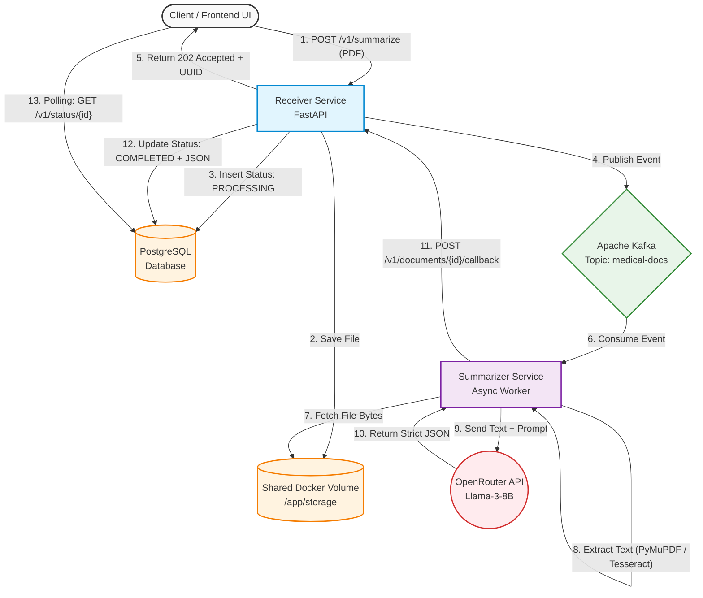

# 🏥 MedSum-India: AI-Powered Medical Summarization Pipeline

An asynchronous, event-driven microservices architecture designed to automate medical underwriting for the Indian health insurance sector. This Proof of Concept (POC) ingests unstructured medical documents (e.g., hospital discharge summaries, Ayushman Bharat records), extracts clinical text, and leverages LLMs to output structured risk stratifications.

## 🚀 Business Value
Manual medical underwriting is a bottleneck in claim processing. This platform accelerates decision-making by:
1. **Automating Text Extraction**: Handling both native PDFs and scanned images via OCR.
2. **Clinical Summarization**: Distilling multi-page medical histories into concise summaries.
3. **Risk Stratification**: Automatically classifying patients into deterministic risk buckets (**RED**, **YELLOW**, **GREEN**) based on strict underwriting guidelines.

---

## 🏗️ System Architecture

The system utilizes an asynchronous worker pattern decoupled by Apache Kafka to ensure high availability and scalability during heavy document ingestion.

### Workflow Diagram



---

## 🛠️ Technology Stack

* **API Gateway & Routing**: FastAPI, Uvicorn, Pydantic
* **Message Broker**: Apache Kafka (Official Apache image with KRaft mode)
* **Database**: PostgreSQL (Relational states + JSONB storage)
* **NLP & Extraction**: PyMuPDF (Native Text), Tesseract OCR / Poppler (Image fallback)
* **AI Engine**: OpenAI Python SDK routed through OpenRouter (`meta-llama/llama-3-8b-instruct`)
* **Infrastructure**: Docker & Docker Compose (Multi-stage builds, shared volumes)

---

## 📁 Repository Structure

```text
medsum-india/
├── docker-compose.yml          # Orchestrates Postgres, Kafka, and Microservices
├── .env                        # Environment variables (Ignored by Git)
├── .gitignore                  # Production security rules
├── infrastructure/
│   └── init.sql                # Auto-provisions PostgreSQL tables on boot
└── services/
    ├── receiver-service/       # Ingestion & Database Interface
    │   ├── Dockerfile
    │   ├── requirements.txt
    │   └── app/
    │       ├── main.py         # FastAPI Endpoints & Callbacks
    │       └── kafka_producer.py
    └── summarizer-service/     # AI & NLP Processing Worker
        ├── Dockerfile
        ├── requirements.txt
        └── app/
            ├── main.py         # Kafka Consumer Loop
            ├── nlp_engine.py   # Hybrid OCR & LLM Integration
            └── test_phase2.py  # Standalone testing module

```

---

## ⚙️ Getting Started

### Prerequisites

* Docker Desktop installed and running.
* Git installed.
* An active [OpenRouter](https://openrouter.ai/) API key.

### 1. Clone the Repository

```bash
git clone [https://github.com/your-username/medsum-india.git](https://github.com/your-username/medsum-india.git)
cd medsum-india

```

### 2. Environment Setup

Create a `.env` file in the root directory:

```bash
DB_USER=medsum_user
DB_PASSWORD=supersecret123
DB_NAME=medsum_db
OPENROUTER_API_KEY=sk-or-v1-your-actual-api-key-here

```

### 3. Launch the Architecture

Build and deploy the microservices using Docker Compose. The initial boot will provision the database, establish Kafka KRaft brokers, and install all Python/C++ dependencies.

```bash
docker compose up -d --build

```

*Note: To view the live logs of the background AI worker, use `docker logs -f medsum_summarizer`.*

---

## 🔌 API Documentation

Once the containers are running, the interactive Swagger UI is available at:
👉 **[http://localhost:8000/docs](https://www.google.com/search?q=http://localhost:8000/docs)**

### 1. Upload a Document

* **Endpoint**: `POST /v1/summarize`
* **Content-Type**: `multipart/form-data`
* **Response**: Returns a tracking `request_id`.

```json
{
  "message": "Document accepted for processing",
  "request_id": "c1b2a3d4-e5f6-7890-abcd-1234567890ab",
  "status": "PROCESSING"
}

```

### 2. Check Claim Status

* **Endpoint**: `GET /v1/status/{request_id}`
* **Response**: Returns the asynchronous processing state. Once `COMPLETED`, it includes the structured clinical risk JSON.

```json
{
  "request_id": "c1b2a3d4-e5f6-7890-abcd-1234567890ab",
  "status": "COMPLETED",
  "risk_rating": "YELLOW",
  "summary_json": {
    "patient_summary": "Patient admitted for dizziness, diagnosed with essential hypertension...",
    "key_diagnoses": ["Essential Hypertension"],
    "risk_rating": "YELLOW",
    "underwriting_reason": "Managed lifestyle disease requiring premium loading."
  }
}

```

---

## 🛣️ Project Roadmap

* [x] **Phase 1:** Foundation & API Scaffolding (FastAPI + PostgreSQL)
* [x] **Phase 2:** Core NLP Engine (OCR Fallback + OpenRouter JSON Enforcement)
* [x] **Phase 3:** Event-Driven Integration (Apache Kafka Asynchronous Loops)
* [ ] **Phase 4:** Reliability Engineering (PyTest, Testcontainers, and CI/CD pipelines) *<- Current Phase*

```
***

### How to add this to your project:
1. Create a file named `README.md` in your `C:\Users\Anurag\OneDrive\Desktop\MedSumIndia` folder.
2. Paste the contents of the code block above into it.
3. Commit it to GitHub:
   ```bash
   git add README.md
   git commit -m "docs: generate comprehensive README with mermaid architecture diagrams"
   git push origin <your-branch-name>

```
